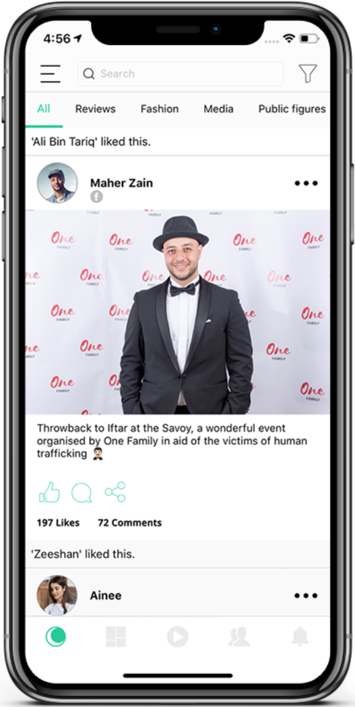
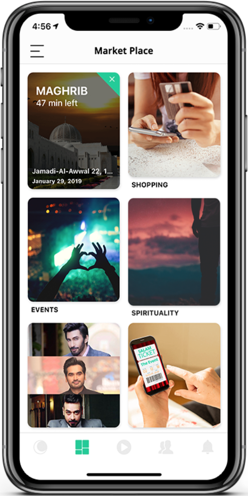
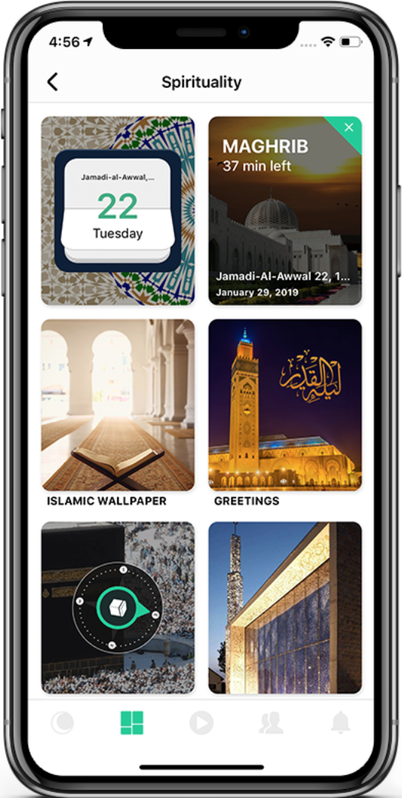
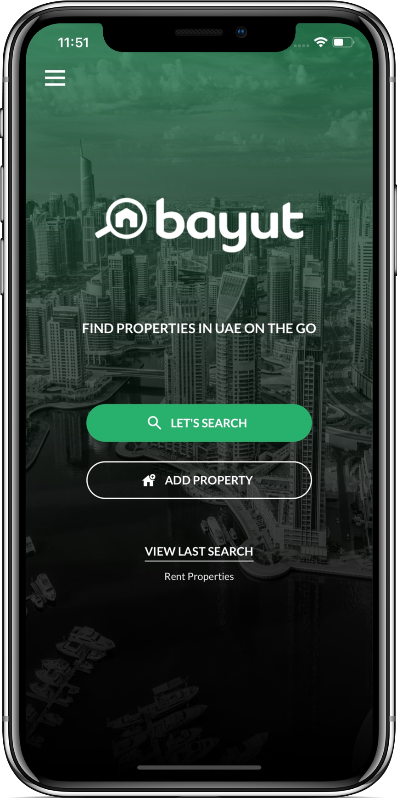
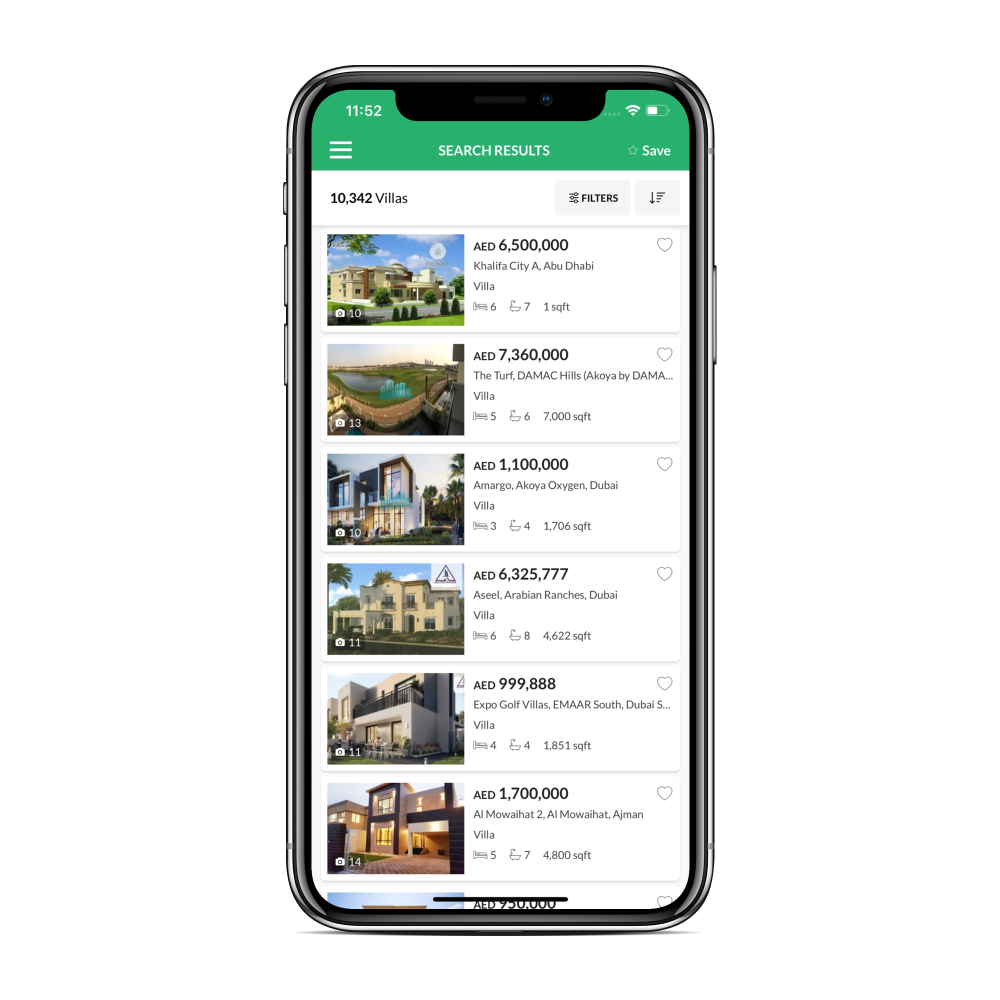
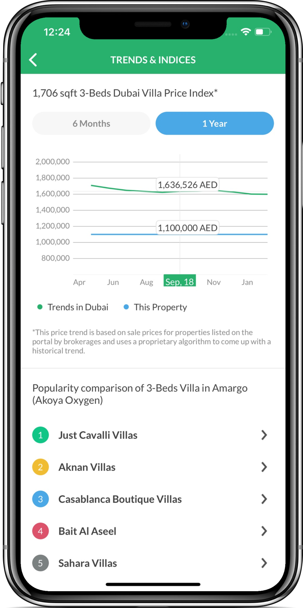
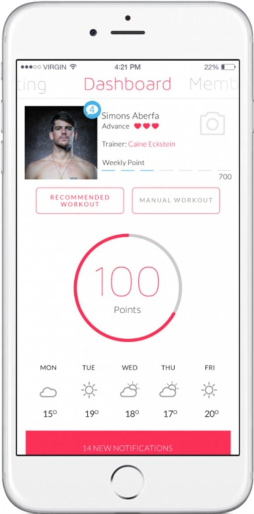
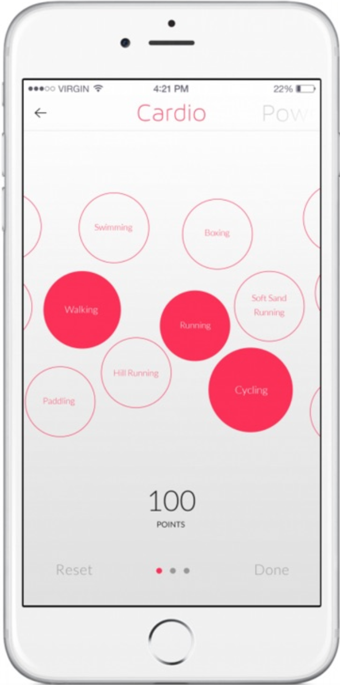
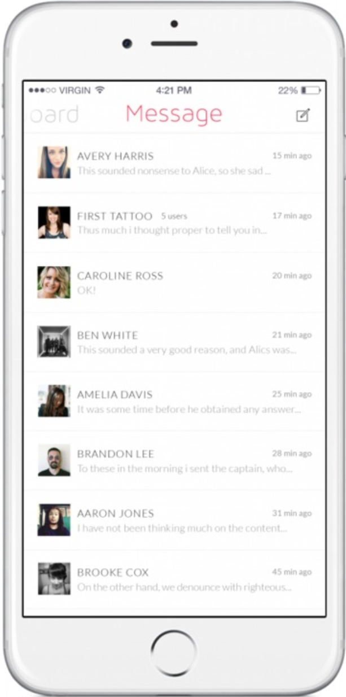

Professionally taught iOS Engineer with 6 years experience. 
I have spent my career leading client-side iOS development in Denmark and Pakistan.
I have done multiple iOS applications ranging from social apps, classified ads and expense tracker.
# Hidebox
An innovative, quick and easy way to keep track of your possessions giving you the ease of having the information on you when you need it the most.

I'm extremely pleased with how the project came out. I'm particularly proud of the app's animation, UI design, and easily-extended architecture (MVVM-Coordinators). Hidebox is built with Xcode and written entirely in Swift 5. It utilizes Auto Layout for UI design. Hidebox is my ongoing project.

### My Role ###
Lead iOS developer and team lead for iOS and Android. Communicating with client, understanding requirements and sprint planning.

### Technologies ###
Swift(4-5), CoreData, CoreLocation, AVFoundation, Photos, Push Notifications, Alamofire, Keychain, GoogleMaps, Firebase, Kingfisher, Hero, Lottie-Animations, GoogleSignIn, FBSDKLoginKit

&nbsp;&nbsp;&nbsp;&nbsp;&nbsp;&nbsp;&nbsp;&nbsp;&nbsp;&nbsp;

# SalamPlanet
The Ultimate Muslim Lifestyle App.
Explore Your Muslim Lifestyle – Socialize, Eat, Play and Pray with SALAM PLANET!

Worked with a fast paced team to deliver features as soon as possible to the 500k users. SalamPlanet is written in Objective-C with some Swift modules. It has Storyboards as well as nibs. 

### My Role ###
Sole iOS developer. My responsibilites were to communicate with product owner, guide UI/UX team about the future flows. 

### Technologies ###
Objective-C, CoreData, AVFoundation, Photos, Core Location, Push Notifications, AFNetworking, Keychain, GoogleMaps, Firebase, FBSDKLoginKit

&nbsp;&nbsp;&nbsp;&nbsp;&nbsp;&nbsp;&nbsp;&nbsp;&nbsp;&nbsp;

# Bayut – UAE Property Search
The Bayut App connects you with a vast database of active properties in the UAE, allowing you to find apartments, villas, offices, townhouses and shops – whether for sale or for rent – on the go.

Worked with a team to deliver features and fix issues as soon as possible to the 100k users. Bayut is written in Objective-C. UI is build using Xibs and code.

### My Role ###
Team consit of three iOS developers. My responsibilites were to estimate the new tasks, develop them and clean the previous written code to modern architecture i-e MVVM.

### Technologies ###
Objective-C, CoreData, Localization, , Core Location, Push Notifications, AFNetworking, GoogleMaps, Firebase, Flurry

&nbsp;&nbsp;&nbsp;&nbsp;&nbsp;
&nbsp;&nbsp;&nbsp;&nbsp;&nbsp;

# 100Club
Achieve your fitness goals with 100 Club App, the free, socially interactive fitness app. 100 Club App uses your mobile device’s location services to connect you with other 100 Club members closest to you, to interact, encourage, motivate and achieve your daily 100 point goals together!

Worked remotely with a team of 3-4 developers. 100Club is written in Objective-C, most of the work is done using UIKit and some animations are achieved through sprite-kit.  

### My Role ###
iOS developer. My responsibilities were, understand the requirements, estimate the tasks, provide feedback and get work done according to estimates.

### Technologies ###
Objective-C, Kinvey,Sprite Kit, Core Location, Push Notifications, AFNetworking, Firebase, FBSDKLoginKit

&nbsp;&nbsp;&nbsp;&nbsp;&nbsp;
&nbsp;&nbsp;&nbsp;&nbsp;&nbsp;

