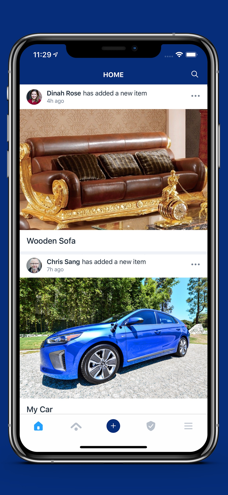
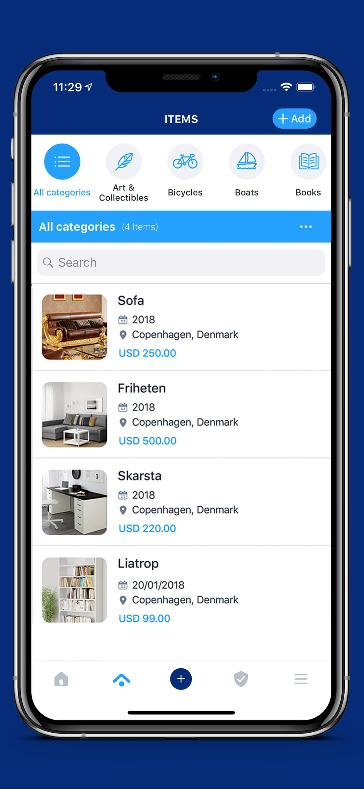
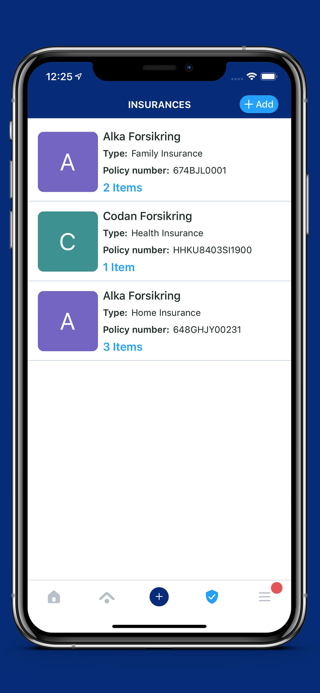

# Hidebox
An innovative, quick and easy way to keep track of your possessions giving you the ease of having the information on you when you need it the most.

I'm extremely pleased with how the project came out. I'm particularly proud of the app's animation, UI design, and easily-extended architecture (MVVM-Coordinators). Hidebox is built with Xcode and written entirely in Swift 5. It utilizes Auto Layout for UI design. Hidebox is my ongoing project.

### My Role ###
Lead iOS developer and team lead for iOS and Android. 

### Technologies ###
Swift(4-5), CoreData, AVFoundation, Photos, Alamofire, Keychain, GoogleMaps, Firebase, Kingfisher, Hero, Lottie-Animations, GoogleSignIn, FBSDKLoginKit

&nbsp;&nbsp;&nbsp;&nbsp;&nbsp;&nbsp;&nbsp;&nbsp;&nbsp;&nbsp;

